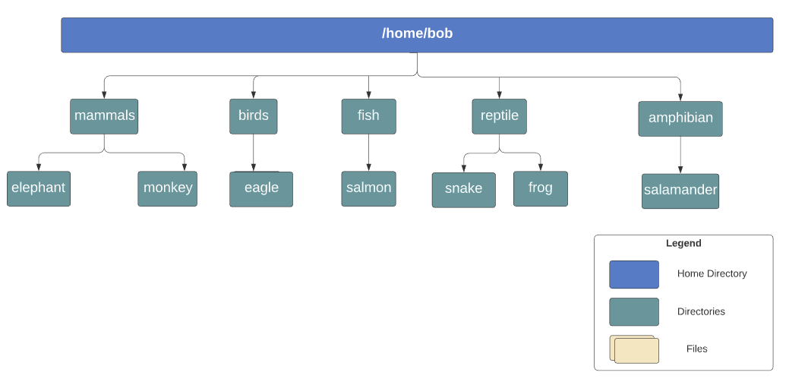

# Basic Linux Commands
1. What is the home directory for the user called bob? 
/home/bob/
2. Which command will show you your home directory? echo $HOME
3. In the command echo Welcome, what does the word Welcome represent with respect to the command?   Welcome represents de argument 
4. What type of command is git? git is hashed so it is a binary command.It is also an installed command
5. Now, lets create some directories! Refer to the below diagram and create the directory called birds. Create the directory /home/bob first.   
sudo mkdir -p /home/bob  and  sudo mkdir -p /home/bob/birds	

6. Next, create the directories /home/bob/fish/salmon.
Use the -p option to create both directories in one go .   sudo mkdir -p /home/bob/fish/salmon
7. Now create all the remaining directories as per the diagram below.
= sudo mkdir -p /home/bob/mammals/elephant   and   sudo mkdir -p /home/bob/mammals/monkey
= sudo mkdir -p /home/bob/birds/eagle
= sudo mkdir -p /home/bob/reptile/snake  and  sudo mkdir -p /home/bob/reptile/frog
= sudo mkdir -p /home/bob/amphibian/salamander
8. Moving along. Lets now move the directory called frog from reptile to the directory amphibian. sudo mv reptile/frog amphibian/
9. Next, rename the directory snake to crocodile. sudo mv snake crocodile
10. Finally, delete the directory called reptile along with its contents. rm -r reptile

# Linux Kernel
1. What is the exact version of kernel running in your system? 6
2. What is the Kernel Version? 6.8.0.44-generic
3. What is the major version number of the kernel? 8
4. What is the command to print the messages generated by the kernel? dmesg
5. How many block devices of type disk are present in the system?

# Linux Kernel Modules Boot and Filetypes
1. What is the init process used by this system? 
2. What is the default systemd target set in this system?
3. Now, change the target to multi-user.target
4. What type of file is firefox.deb located at /root?
5. What type of file is sample_script.sh located at /root?
6. You are asked to install a new third-party IDE (integrated development environment ) in the system.  
Which directory is the recommended choice for the installation?
7. Which directory contains the files related to the block devices that can be seen when running the lsblk command? disk, partitions and LVM
8. What is the name of the vendor for the Ethernet Controller used in this system?

# Package Management: DPKG and APT
1. Which of the following package managers would you use on a debian based distro? apt
2. Download the package for firefox browser. 
Try to install it using sudo dpkg -i
3. Was the installation successful ?
4. Why did it fail?
5. Let's use apt to install it firefox. sudo apt install firefox
6. Lets now locate the package to install Chromium browser in the system.  
Use apt search functionality to locate the correct package name.
The browser has the description of: Chromium web browser, open-source version of Chrome  
What is the correct package name?
7. Finally, remove the firefox browser from the system. sudo apt autoremove firefox

# Working with Shell
1. Create a tarball of the directory called python and compress it using gzip. The compressed tar file should be available at /home/corine/python.tar.gz.  
2. A file called caleston-code has been copied somewhere inside the /opt directory. But, Bob does not remember which directory he saved it in.  
Can you find it?  
3. Find the location of the file called dummy.service under /etc filesystem and redirect its absolute path to the file /home/corine/dummy-service.  
You can use the redirect operator with the echo command to save the answer to the file. 
4. Find the file under /etc directory that contains the string 172.16.238.197. Save the answer using the absolute path in the file /home/corine/ip  
5. Create a new file called /home/corine/file_with_data.txt. This file should have one line of text that says a file in my home directory.  
Make use of the redirect operator.  
6. Run the command python3 /home/corine/my_python_test.py and redirect the standard error to the file /home/corine/py_error.txt.

# DNS
1. What is the IP address of the DNS Server used in this system?
2. Which file is responsible for host file-based DNS resolution?
3. What is the configuration file used for the DNS Server?
4. Change the DNS Server to google's DNS which is 8.8.8.8
5. Which order is used currently to resolve an IP address in the system?  
Check the nsswitch.conf file
6. Change the order to DNS first and then hosts.
7. Which search domain is configured in this system ? 
Inspect the DNS configuration file.

# Network basics
1. What is the IP Address assigned to Bob's Laptop?  
2. What is the name of the interface that has this IP (from the previous question) address assigned?  
3. What is the default gateway configured in the system?  

